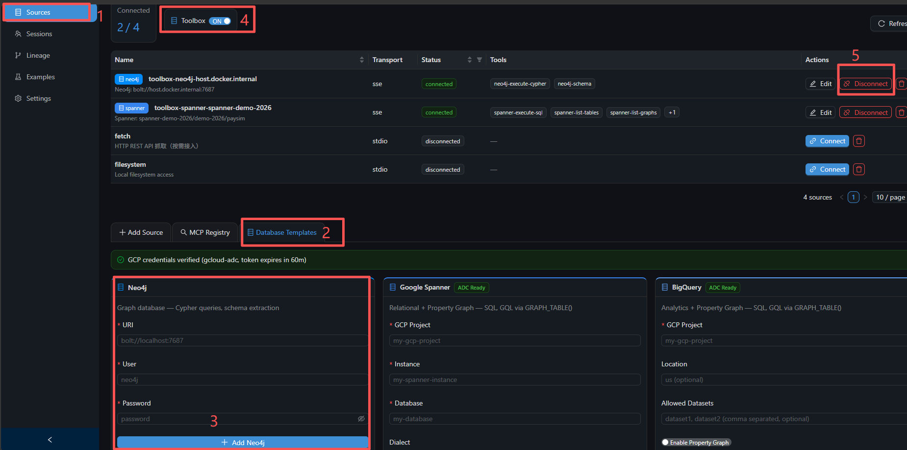
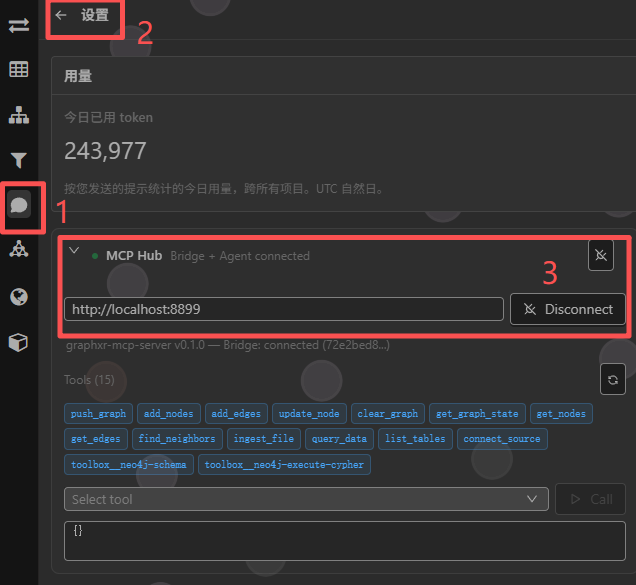

# GraphXR MCP Hub


> 面向 GraphXR 的统一 MCP 数据中枢 —— 一键启动，Web UI 配置数据源。

把 Neo4j、Google Spanner、BigQuery、PostgreSQL、CSV 文件等各种数据源统一接入 GraphXR 及任意 MCP 客户端（Claude Desktop、GraphXR Agent、Codex 等）。


中文文档：[README.zh.md](./README.zh.md) | English documentation: [README.md](./README.md)


---

## 快速开始

### 准备工作

- 已安装 **Docker Desktop**（Windows / Mac）或 **Docker Engine + Compose**（Linux）
- （可选）若需访问 Google Cloud Spanner / BigQuery，先在宿主机执行 `gcloud auth application-default login`

### 一键启动

不需要克隆整个仓库，只下载两个文件即可：

```bash
mkdir graphxr-mcp-hub && cd graphxr-mcp-hub

# 下载 docker-compose 和环境变量模板
curl -fsSL -o docker-compose.yml https://raw.githubusercontent.com/Kineviz/graphxr-mcp-hub/main/docker-compose.yml
curl -fsSL -o .env https://raw.githubusercontent.com/Kineviz/graphxr-mcp-hub/main/.env.example

# 启动
docker compose up -d
```

Windows PowerShell 用户：

```powershell
mkdir graphxr-mcp-hub; cd graphxr-mcp-hub
iwr -OutFile docker-compose.yml https://raw.githubusercontent.com/Kineviz/graphxr-mcp-hub/main/docker-compose.yml
iwr -OutFile .env              https://raw.githubusercontent.com/Kineviz/graphxr-mcp-hub/main/.env.example
docker compose up -d
```

默认端口：
- **http://localhost:8899/admin** —— Web 管理界面
- **http://localhost:8899/health** —— 健康检查
- **http://localhost:5000** —— genai-toolbox（数据库适配层）

### 验证启动

```bash
curl http://localhost:8899/health
# → {"status":"ok","service":"graphxr-mcp-server",...}
```

浏览器打开 **http://localhost:8899/admin** 进入管理面板。

---

## 通过 Web UI 配置数据源

所有数据库连接都在 Admin UI 里配置，无需手动编辑配置文件。

### 1. Sources 页面

访问 **http://localhost:8899/admin/sources/database**  

页面顶部会显示 **GCP 凭证状态**：
- ✅ 绿色 = ADC 凭证已生效（宿主机 gcloud 已授权）
- ⚠️ 黄色 = 未发现凭证，需要在宿主机跑 `gcloud auth application-default login`

### 2. 添加数据源

点击 **Add Source**，从模板中选择数据库类型：



| 数据库 | 需要填写的信息 |
|---|---|
| **Neo4j** | URI、用户名、密码 |
| **Google Spanner** | GCP 项目 ID、实例名、数据库名（凭证走 ADC） |
| **BigQuery** | GCP 项目 ID、地域（凭证走 ADC） |
| **PostgreSQL** | 主机、端口、数据库、用户名、密码 |
| **SQLite** | 数据库文件路径 |

> **连接宿主机数据库时**：主机名填 `host.docker.internal`（Windows/Mac 可直接用；Linux 需 docker-compose.yml 已配好 host-gateway）。

### 3. 配置完成

保存后，工具会自动出现在 MCP 工具列表中，以 `{source}__{tool}` 格式命名（例如 `neo4j__execute_cypher`、`spanner__query_graph`）。

所有 MCP 客户端重新连接后即可调用。

---

## 连接 MCP 客户端

所有客户端都通过 Hub 的 SSE 端点连接：

```
http://localhost:8899/sse
```

### GraphXR Agent 2（浏览器端）

1. 打开 GraphXR，点击右上角 **Agent 2** 面板
2. 进入 **Settings** 页面
3. 在 **MCP Servers** 区块点击 **Add Server**
4. 填入：
   - **Name**：`graphxr-mcp-hub`
   - **Transport**：`SSE`
   - **URL**：`http://localhost:8899/sse`
5. 保存后，Agent 会自动加载 Hub 暴露的所有工具（图操作 + 已配置的数据源）



### Claude Code（命令行）

```bash
claude mcp add graphxr-mcp-hub --transport sse http://localhost:8899/sse
```

查看已添加：`claude mcp list`
移除：`claude mcp remove graphxr-mcp-hub`

### Claude Desktop

编辑 `claude_desktop_config.json`（Windows: `%APPDATA%\Claude\`、macOS: `~/Library/Application Support/Claude/`）：

```json
{
  "mcpServers": {
    "graphxr-mcp-hub": {
      "transport": "sse",
      "url": "http://localhost:8899/sse"
    }
  }
}
```

### Codex CLI

```bash
codex mcp add graphxr-mcp-hub --transport sse --url http://localhost:8899/sse
```

或手动编辑 `~/.codex/config.toml`：

```toml
[mcp_servers.graphxr-mcp-hub]
transport = "sse"
url = "http://localhost:8899/sse"
```

### Gemini CLI

```bash
gemini mcp add graphxr-mcp-hub --transport sse http://localhost:8899/sse
```

或手动编辑 `~/.gemini/settings.json`：

```json
{
  "mcpServers": {
    "graphxr-mcp-hub": {
      "httpUrl": "http://localhost:8899/sse"
    }
  }
}
```

---

## Google Cloud 授权（可选）

如果你要使用 Spanner 或 BigQuery，需要把宿主机的 gcloud ADC 凭证共享给容器。

### 步骤

1. **宿主机授权**：
   ```bash
   gcloud auth application-default login
   ```
2. **确认 `.env` 中 `CLOUDSDK_CONFIG` 指向 gcloud 配置目录**：
   - Windows: `C:/Users/<用户名>/AppData/Roaming/gcloud`
   - macOS / Linux: `~/.config/gcloud`
3. **重启容器**：
   ```bash
   docker compose up -d --force-recreate
   ```
4. **打开 admin 页面的 Sources 标签**，顶部凭证提示应变为 ✅ 绿色，并显示 token 过期时间。

> Hub 会将宿主机的 gcloud 目录只读挂载到容器，所有基于 ADC 的 GCP SDK 调用可直接复用。

---

## 常用操作

### 启动 / 停止

```bash
docker compose up -d          # 后台启动
docker compose down           # 停止并清理
docker compose logs -f        # 查看日志
docker compose ps             # 查看容器状态
```

### 更新到最新版本

```bash
docker compose pull
docker compose up -d
```

### 修改端口

编辑 `.env`：

```env
GRAPHXR_MCP_PORT=9000
```

然后 `docker compose up -d --force-recreate`。

---

## Admin UI 功能

| 页面 | 功能 |
|---|---|
| **Dashboard** | 整体状态、服务健康、数据源概览 |
| **Sources** | 管理数据源连接（Neo4j / Spanner / BigQuery / PostgreSQL…） |
| **Sessions** | 实时查看已连接的 MCP 客户端 |
| **Lineage** | 数据血缘日志：哪个客户端、什么时间、推送了什么数据 |
| **Examples** | 预置示例 prompt 及调用方法 |
| **Settings** | 端口、日志级别、Kafka、Ollama 等高级配置 |

---

## MCP 工具一览

### 图数据操作（针对 GraphXR WebGL 画布）

| 工具 | 说明 |
|---|---|
| `push_graph` | 替换画布全量图数据 |
| `add_nodes` / `add_edges` | 增量追加节点 / 边 |
| `update_node` | 更新节点属性 |
| `clear_graph` | 清空画布 |
| `get_graph_state` | 当前图的统计信息 |
| `get_nodes` / `get_edges` | 查询当前图内容 |
| `find_neighbors` | 查找某节点的邻居 |

### 数据接入（内置 DuckDB，支持 CSV / JSON / Parquet）

| 工具 | 说明 |
|---|---|
| `ingest_file` | 加载本地文件，返回 schema + 示例 |
| `query_data` | 执行 SQL，可选直接推送到 GraphXR |
| `list_tables` | 列出已加载的数据表 |

### 外部数据源工具

通过 Admin UI 添加的数据源会自动暴露其工具，格式 `{source}__{tool}`，例如：
- `neo4j__execute_cypher`
- `spanner__query_graph`
- `bigquery__execute_sql`

---

## 常见问题

**Q：端口 8899 被占用**
修改 `.env` 中 `GRAPHXR_MCP_PORT` 为其他端口，重启容器。

**Q：容器无法连接宿主机 Neo4j / PostgreSQL**
连接主机名使用 `host.docker.internal` 而不是 `localhost`。Linux 用户需确保 [docker-compose.yml](docker-compose.yml) 中有 `extra_hosts` 映射。

**Q：Admin 页面显示 "GCP credentials not found"**
- 先在宿主机执行 `gcloud auth application-default login`
- 确认 `.env` 中 `CLOUDSDK_CONFIG` 路径正确
- `docker compose up -d --force-recreate` 重启

**Q：想要清空所有数据重新开始**
```bash
docker compose down -v
rm -rf data/
docker compose up -d
```

**Q：如何查看容器内部错误**
```bash
docker compose logs graphxr-mcp-server
docker compose logs genai-toolbox
```

---

## 数据与配置位置

| 位置 | 说明 |
|---|---|
| `.env` | 环境变量（端口、GCP 路径、数据库默认值） |
| `config/tools.yaml` | 数据源配置（由 Admin UI 自动维护，无需手动编辑） |
| `config/hub_config.yaml` | Hub 全局配置（日志、Kafka、Ollama 开关等） |
| `data/` | 本地数据文件挂载目录，可放 CSV / JSON / Parquet |

---

## 许可证与支持

- 项目主页：https://github.com/Kineviz/graphxr-mcp-hub
- 反馈与问题：Issues
- 维护团队：Kineviz
